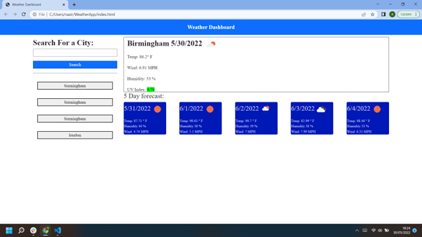

Weather Dashboard 

Description
A dashboard to see the weather forecast for multiple cities, built using the OpenWeather API. This weather dashboard has been designed to help users look at the current weather in their cities and other cities as well as the predicted forecast for the next 5 days.

When the user searches for a location, they are presented with the current weather and a 5 day forecast. Weather information includes, temperature, wind speed, humidity, UV Index, and an easy to interpret weather icon. The UV index is colour coded to allow users to easily interpret the value.

Technology stack:

OpenWeather API
HTML, CSS, and JavaScript
Bootstrap  CSS 
Deployed to GitHub Pages

Screenshot of App

Links: 
https://github.com/aali9/WeatherApp
